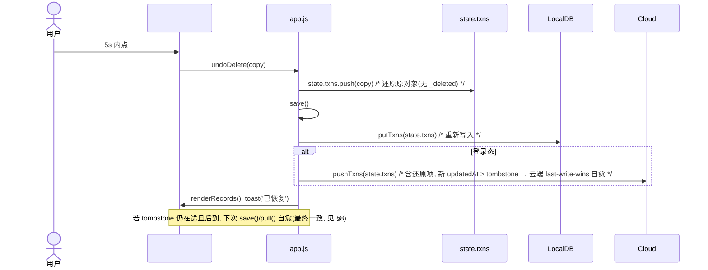
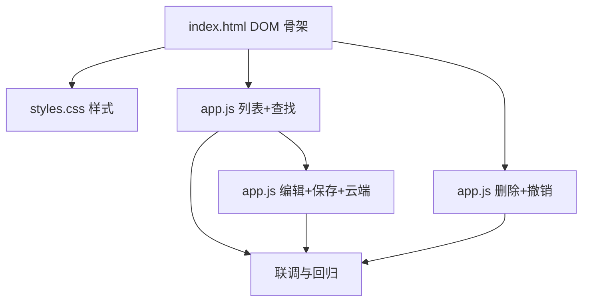

# 安记(Ānjì) 增量架构设计：记账数据「查找 / 修改 / 删除」管理区

> 范围：仅描述本次变更部分（Quick Log 页新增「我的记录」管理区）。全局架构、Home/Insight、底部导航、`server/api.js` 不在范围内。
> 代码核验：以下结论已用 Read 工具逐项比对 `app.js / localdb.js / cloud.js / server/api.js / index.html / styles.css` 源码，非凭空假设。

---

## 0. 代码核验结论（硬约束，已读源码确认）

1. **字段名是 `category`，不是 PRD 写的 `catKey`**。`submitLog()`（app.js 第 473 行）存入 `category`；`sumByCategory` / `buildReview` / `renderRecent` / `aggregateMonth` 全部读 `t.category`。本增量所有新增/修改代码一律用 `category`。
2. **内存真值在 `state.txns`**。`save()`（app.js 第 165 行）做两件事：`LocalDB.putTxns(state.txns)`（整批重写 IndexedDB，含 localStorage 降级）与登录态下 `Cloud.pushTxns(state.txns)`（整批推云端）。因此「编辑 = 改 `state.txns` 中该对象 + 调 `save()`」；「删除」按路线 B 处理（见 §1.2）。
3. **localdb.js 当前 API**：`getAllTxns / putTxns(整批) / clearTxns / getGoals / saveGoals / clearAll / migrateFromLocalStorage / isFallback`。无单条删除/修改/查询 API。
4. **删除同步悖论** → 选定 **路线 B**（§1.2）。
5. **Home「最近记录」自动一致**：`renderHome` 读 `state.txns`（路线 B 下不含已删项），删除后 Home 预览自动不显示，无需额外联动。
6. **现有模态基础设施可复用**：`index.html` 的 `#goal-modal`（`.modal/.modal-card/.modal-text/.modal-actions`）与 `.goal-add`/`.goal-cancel` 按钮样式可直接复用，编辑/确认弹窗保持视觉一致。
7. **分类规则可复用**：`CATEGORIES` 数组（含 `key/label/color/keywords`）+ `catByKey()`，`buildCatList()` 的 chip 交互可照搬为 `buildEditCatList()`。
8. **新增约束（源码实测补充）**：`toast()` 固定 1400ms 自动隐藏，不足以承载 5s 撤销窗口；需新增独立的 `#undo-toast`（带「撤销」按钮 + 5s 计时）。

---

## 1. 增量实现方案

### 1.1 框架选型
**沿用原生 HTML + CSS + JS，零新依赖、无构建**。与既有技术栈完全一致，不引入框架/打包器，降低交付与回归风险。

### 1.2 删除路线决策：选 **路线 B（本地移除 + 单独推 tombstone）**

**方案**：删除时（1）从 `state.txns` 中 `filter` 移除该对象 → 本地聚合（总额/分类/Insight/Home 最近记录）天然不再计入，零改动；（2）调用 `save()` → `LocalDB.putTxns(state.txns)` 整批重写（已删干净）+ 登录态下 `Cloud.pushTxns(state.txns)` 整批推剩余项（**不含被删项**）；（3）**单独** `Cloud.pushTxns([{ id, _deleted: true, updatedAt: Date.now() }])` 把删除传播到云端。未登录时只做（1）（2）。

**理由（对比路线 A）**：
- **聚合函数零改动**：路线 A 需保留 `_deleted` tombstone 在 `state.txns` 中，则 `sumByMonth/sumByCategory/buildReview/renderRecent/renderHome` 全部要加 `!t._deleted` 过滤，改动点多、易漏、回归面大；路线 B 本地直接移除，聚合逻辑完全不动。
- **Home/Insight 自动一致**：路线 B 下 `state.txns` 已是"干净真相"，所有既有消费视图天然正确，无需联动。
- **云端删除仍可用**：`_deleted` tombstone 单独推，复用 server 既有 `if (it._deleted) del.run(...)` 逻辑，满足"登录态下删除同步云端"。
- **撤销简单**：撤销 = 把原对象（无 `_deleted`）重新 `push` 回 `state.txns` 并 `save()`，云端因 last-write-wins（新 `updatedAt`）自愈。

**函数签名与调用顺序（精确）**：
```js
// 删除（路线 B 核心）
function deleteTxn(id) {
  var copy = null;
  for (var i = 0; i < state.txns.length; i++) if (state.txns[i].id === id) { copy = Object.assign({}, state.txns[i]); break; }
  if (!copy) return null;
  state.txns = state.txns.filter(function (t) { return t.id !== id; });
  save(); // 整批重写 IndexedDB（已删干净）+ 整批 pushTxns(剩余项)
  if (typeof Cloud !== 'undefined' && Cloud.isLoggedIn()) {
    Cloud.pushTxns([{ id: id, _deleted: true, updatedAt: Date.now() }]).catch(function () {}); // tombstone 单独推
  }
  return copy; // 供撤销还原
}
```
> 注：`save()` 内部 `Cloud.pushTxns(state.txns)` 推的是剩余项（不含被删），与 tombstone 推送作用于不同 `client_id`，互不冲突；server 按 `user_id + client_id` 处理，最终该条被逻辑删除。

### 1.3 localdb.js / cloud.js / server/api.js 均**不变**（决策说明）
- **localdb.js 不变**：PRD 2.2 表建议新增 `updateTxn/deleteTxn/queryTxns`，但路线 B + "save() 为唯一持久化入口"下，单条变更 = 直接改 `state.txns` + `save()`，等价于"读全部→改内存→putTxns 回写"且无需新增 API 面。新增封装反而要与 `state` 耦合、易分歧。**故 localdb.js 本次零改动**，降低风险。
- **cloud.js 不变**：直接复用现有 `pushTxns`（已支持数组/单条 + `_deleted`/`updatedAt`），不改动同步逻辑。
- **server/api.js 不变**：已支持 `_deleted` 逻辑删除与 last-write-wins，本次不引入新协议。

> 这是相对 PRD 文件变更表的有意偏差，已在 §2 标注。理由：最小改动面、与路线 B 一致、避免 API 冗余。

### 1.4 PRD 待确认项拍板（给默认决策）
| 待确认项 | 拍板决策 | 说明 |
|---|---|---|
| 编辑形态 | **弹窗**（复用 `.modal` 机制） | 移动端更稳、易测试；复用 `catByKey` + chip 交互（参考 `buildCatList`）。 |
| 列表加载 | **纯滚动 + 倒序**；>50 条才考虑分页，**v1 不做分页** | 数据量级百条级，内存渲染流畅；滚动原生支持。 |
| 撤销 | **P1 实现，5s 窗口**，toast 旁「撤销」按钮 | 见 §3 `showUndoToast`。 |
| 查找范围 | **关键词(note+amount) + 分类 + 时间范围(起止日期)**；暂不做金额区间 | 满足 FR-1~FR-3。 |
| 本地查询 | **内存过滤**（`queryTxns` 在 app.js 内实现）；localdb 不新增便捷 API | 与 §1.3 一致。 |

---

## 2. 文件列表与相对路径 + 具体改动点

> 绝对根目录：`/Users/mac/WorkBuddy/2026-07-26-22-39-42/`

| 文件 | 是否改 | 具体改动点 |
|---|---|---|
| `index.html` | **改** | 在 `#view-log` 内（`<button id="log-submit">` 之后、`</section>` 之前）新增：①「我的记录」卡片（搜索/筛选条 `#records-keyword` / `#records-cat-filter` / `#records-from` / `#records-to` + 列表挂载点 `#records-list` + 空提示 `#records-empty`）；②编辑弹窗 `#edit-modal`（amount/note/分类 chip `#edit-cat-list` + 保存/取消）；③删除确认弹窗 `#confirm-modal`（中性文案 `#confirm-text` + 移除/取消）；④撤销 toast `#undo-toast`（文案 + 「撤销」按钮）。 |
| `styles.css` | **改** | 新增：`.records-card/.records-filter/.records-filter-row/.records-select/.records-date/.records-list/.records-row/.records-left/.records-dot/.records-info/.records-note/.records-cat/.records-amt/.records-actions/.records-btn(.del)` 列表与筛选样式；`#edit-modal .goal-add-input` 间距；`.undo-toast`（复用 `.toast` 视觉 + flex 布局 + 「撤销」按钮）。全部复用既有 CSS 变量（`--accent/--line/--sub/--card/--radius`）。 |
| `app.js` | **改** | 在 `window` 块内新增：模块状态 `recordsFilter/editId/editCatKey`；函数 `queryTxns/renderRecords/beginEdit/buildEditCatList/saveEdit/deleteTxn/confirmDelete/undoDelete/showUndoToast`；`resetLog()` 末尾调 `renderRecords()`；`init()` 内绑定筛选输入与弹窗按钮、构建分类下拉。复用既有 `save()/state.txns/Cloud.pushTxns/catByKey/CATEGORIES/DEFAULT_CAT/escapeHtml/fmtDate/fmtMoney/track`。 |
| `localdb.js` | **不变** | 见 §1.3。 |
| `cloud.js` | **不变** | 复用现有 `pushTxns`。 |
| `server/api.js` | **不变** | 已支持 `_deleted` 与 last-write-wins。 |

---

## 3. 数据结构与接口

### 3.1 现有交易数据模型（复用，强调 `category`）
```js
// 单条交易（submitLog 产出，字段名固定为 category）
{
  id:        't' + Date.now() + Math.floor(Math.random()*1000), // String, 同时作为云端 client_id
  amount:    Number,        // 四舍五入两位小数
  note:      String,        // 备注（可为空）
  category:  String,        // 分类 key（food/transport/.../other）—— 注意不是 catKey
  createdAt: Number,        // 时间戳
  updatedAt: Number|undefined, // 编辑时新增；server last-write-wins 依据
  whyTag:    null,
  goalId:    null
}
```

### 3.2 新增 / 修改的 app.js 函数签名
```js
// —— 模块级状态（window 块内）——
var recordsFilter = { keyword: '', catKey: 'all', from: '', to: '' };
var editId = null;
var editCatKey = 'other';

// —— 查找（内存过滤，倒序）——
// @return Transaction[] 按 createdAt 倒序
function queryTxns(filter) { /* keyword→note+amount 包含; catKey!=='all'→分类; from/to→createdAt 区间 */ }

// —— 渲染「我的记录」——
function renderRecords() { /* 读 queryTxns(recordsFilter)，构建行（金额/category chip/备注截断/时间 + 编辑/删除），空则显 #records-empty */ }

// —— 编辑 ——
function beginEdit(id) { /* 取 t，填充 #edit-amount/#edit-note，buildEditCatList()，显示 #edit-modal */ }
function buildEditCatList() { /* 复用 CATEGORIES.concat([DEFAULT_CAT]) 渲染 #edit-cat-list，点击设 editCatKey */ }
function saveEdit() { /* 取 t，写 amount/note/category/updatedAt=now()，save()，关弹窗，renderRecords()，toast('已更新') */ }

// —— 删除（路线 B）——
function deleteTxn(id) { /* 克隆 copy→从 state.txns 移除→save()→登录态单独推 tombstone；返回 copy */ }
function confirmDelete(id) { /* copy=deleteTxn(id); renderRecords(); showUndoToast('已删除', ()=>undoDelete(copy)) */ }
function undoDelete(copy) { /* state.txns.push(copy); save(); renderRecords(); toast('已恢复') */ }

// —— 撤销 toast（独立，5s 窗口）——
function showUndoToast(msg, onUndo) { /* 显 #undo-toast，绑定按钮 onClick=onUndo，5s 后隐藏 */ }
```

### 3.3 与现有 `save()` 的协作关系
- **编辑**：`saveEdit` 改 `state.txns` 中对象 + 设 `updatedAt` → 调 `save()`。本地整批重写；登录态下 `pushTxns(state.txns)` 含更新项（新 `updatedAt` → 云端 last-write-wins）。
- **删除**：`deleteTxn` 从 `state.txns` 移除 → 调 `save()`（本地已删干净 + 登录态推剩余项）→ **再单独** `pushTxns([{id,_deleted:true,updatedAt}])` 传播删除。
- **撤销**：`undoDelete` 把 `copy` 重新 `push` 回 `state.txns` → 调 `save()`（本地重写 + 登录态推全量，含还原项，新 `updatedAt` > tombstone → 云端自愈）。
- **Home/Insight 自动一致**：三者均只读 `state.txns`，路线 B 下已删项彻底离开内存，无需额外联动。

### 3.4 类 / 模块关系（Mermaid）
```mermaid
classDiagram
    class Transaction {
        +String id
        +Number amount
        +String note
        +String category
        +Number createdAt
        +Number updatedAt
        +String whyTag
        +String goalId
    }
    class AppState {
        +Transaction[] txns
        +recordsFilter{keyword,catKey,from,to}
        +editId
        +editCatKey
    }
    class RecordsModule {
        +queryTxns(filter) Transaction[]
        +renderRecords() void
        +beginEdit(id) void
        +buildEditCatList() void
        +saveEdit() void
        +deleteTxn(id) Transaction
        +confirmDelete(id) void
        +undoDelete(copy) void
        -showUndoToast(msg,onUndo) void
    }
    class SaveFlow {
        +save() void
    }
    class LocalDB {
        <<unchanged>>
        +getAllTxns()
        +putTxns(items)
    }
    class Cloud {
        <<unchanged>>
        +pushTxns(items)
        +isLoggedIn()
    }
    RecordsModule ..> AppState : 读写 state.txns
    RecordsModule ..> SaveFlow : 调用 save()
    SaveFlow ..> LocalDB : putTxns(state.txns)
    SaveFlow ..> Cloud : pushTxns(state.txns)
    RecordsModule ..> Cloud : pushTxns([tombstone])
    RecordsModule ..> Transaction : 过滤/克隆
```

---

## 4. 程序调用流程（Mermaid 时序图）

### 4.1 编辑保存
```mermaid
sequenceDiagram
    actor U as 用户
    participant V as #view-log(我的记录)
    participant A as app.js(RecordsModule)
    participant S as state.txns
    participant L as LocalDB
    participant C as Cloud

    U->>V: 点击某行「编辑」
    V->>A: beginEdit(id)
    A->>S: find txn by id
    A->>V: 填充 #edit-amount/#edit-note + buildEditCatList()，显示 #edit-modal
    U->>V: 改字段 + 选分类 + 点「保存」
    V->>A: saveEdit()
    A->>S: t.amount=amt; t.note=note; t.category=editCatKey; t.updatedAt=now()
    A->>A: save()
    A->>L: putTxns(state.txns)  /* 整批重写 IndexedDB */
    alt 登录态
        A->>C: pushTxns(state.txns)  /* 含更新项, updatedAt last-write-wins */
        C-->>A: ok / fail(仅提示)
    end
    A->>V: 关闭 #edit-modal, renderRecords(), toast('已更新')
```

### 4.2 删除 + 云端推送（路线 B）
```mermaid
sequenceDiagram
    actor U as 用户
    participant V as #view-log(我的记录)
    participant A as app.js
    participant S as state.txns
    participant L as LocalDB
    participant C as Cloud
    participant SV as server /api/txns/sync

    U->>V: 点击某行「删除」
    V->>A: (行按钮) 显 #confirm-modal(温和中性)
    U->>V: 确认「移除」
    V->>A: confirmDelete(id)
    A->>S: copy=clone(txn); state.txns=filter(!=id)
    A->>A: save()
    A->>L: putTxns(state.txns)  /* 已删项不再写入 */
    alt 登录态
        A->>C: pushTxns(state.txns)  /* 剩余项整批推(不含被删) */
        A->>C: pushTxns([{id,_deleted:true,updatedAt:now}])  /* tombstone 单独推 */
        C->>SV: POST /api/txns/sync(items=[tombstone])
        SV-->>C: {ok}  /* 按 client_id 逻辑删除 */
    end
    A->>V: renderRecords()  /* 该条自然消失 */
    A->>V: showUndoToast('已删除', undoDelete)
```

### 4.3 撤销


---

## 5. 增量任务列表（有序、含依赖、按实现顺序）

| Task | 名称 | 改文件 | 依赖 | 优先级 |
|---|---|---|---|---|
| **T1** | 「我的记录」DOM 骨架 | `index.html` | 无 | P0 |
| **T2** | 「我的记录」样式 | `styles.css` | T1 | P0 |
| **T3** | 列表渲染 + 实时查找 | `app.js` | T1 | P0 |
| **T4** | 编辑（弹窗 + 保存 + 云端同步） | `app.js` | T1, T3 | P0 |
| **T5** | 删除 + 确认 + 云端 tombstone + 撤销 | `app.js` | T1, T3 | P0（撤销 P1） |
| **T6** | 联调与回归 | `app.js`(+手动验证) | T3, T4, T5 | P0 |

> 说明：localdb.js / cloud.js / server/api.js 均不变，故无对应任务。

**任务明细**
- **T1（index.html）**：在 `#view-log` 内新增「我的记录」卡片（筛选条 + `#records-list` + `#records-empty`）、`#edit-modal`、`#confirm-modal`、`#undo-toast`（结构见 §2 / 附录样例）。
- **T2（styles.css）**：实现 §2 所列全部新样式，复用既有 CSS 变量与 `.modal/.goal-add/.goal-cancel` 规范。
- **T3（app.js 列表+查找）**：新增 `recordsFilter/editId/editCatKey`、`queryTxns`、`renderRecords`；`resetLog()` 末尾调 `renderRecords()`；`init()` 内绑定 `#records-keyword/#records-cat-filter/#records-from/#records-to`，构建分类下拉，行内绑定编辑/删除按钮（删除按钮先开 `#confirm-modal`）。
- **T4（app.js 编辑）**：`beginEdit/buildEditCatList/saveEdit`；编辑弹窗「保存」写 `amount/note/category/updatedAt` 并 `save()`，`toast('已更新')`；「取消」关弹窗还原。
- **T5（app.js 删除/撤销）**：`deleteTxn/confirmDelete/undoDelete/showUndoToast`；删除走路线 B（本地移除 + 单独 tombstone 推送）；`#confirm-modal` 文案温和中性；`#undo-toast` 5s 窗口。
- **T6（联调回归）**：验证 ① 未登录态编辑/删除仅本地生效（Home 不显示已删）；② 登录态删除后 `/api/txns/sync` 收到 `_deleted`、云端 pull 不再返回；③ 撤销 5s 内还原、超窗失效；④ 聚合/Home/Insight 不受 `_deleted` 影响；⑤ 筛选实时生效、空结果中性提示。

**任务依赖图**


---

## 6. 依赖包列表
**无新依赖**。纯原生 HTML+CSS+JS，沿用现有 `app.js/localdb.js/cloud.js/server`（server 栈 Node+Express+SQLite+JWT 均不变）。

---

## 7. 共享知识（跨文件约定）
- **字段名统一用 `category`**（非 `catKey`）；分类值取 `CATEGORIES`/`DEFAULT_CAT` 的 `key`。
- **日期范围用 `createdAt` 时间戳比较**：`from` 取当日 00:00:00，`to` 取当日 23:59:59.999。
- **`_deleted` tombstone 仅存在于云端推送载荷**，绝不写入 `state.txns`/IndexedDB（路线 B）。
- **toast 文案中性**：`已更新` / `已删除` / `已恢复`；删除确认文案 `确定要移除这笔记录吗？`，禁止红色告警/焦虑词。
- **复用模态与 chip**：编辑/确认弹窗复用 `.modal/.modal-card/.modal-actions` 与 `.goal-add`/`.goal-cancel`；分类 chip 复用 `catByKey` + `CATEGORIES.concat([DEFAULT_CAT])`。
- **唯一持久化入口是 `save()`**（本地 `putTxns` + 登录态 `pushTxns`）；任何单条变更先改 `state.txns` 再 `save()`。
- **列表倒序**：`queryTxns` 统一按 `createdAt` 降序。
- **同步失败不阻断本地**：沿用 `save()` 既有 fire-and-forget + 失败 toast 提示风格。

---

## 8. 待明确事项（风险 / 需最终确认）
1. **撤销与 tombstone 竞态（最终一致可接受）**：路线 B 下，删除推 tombstone、撤销重推全量（含还原项，新 `updatedAt`）。若 tombstone 在还原推送**之后**才到达云端，会再次逻辑删除该条。按已确认决策接受"最终一致"——下次 `save()`/`pull()` 自愈；如要求更强保证，可在 `undoDelete` 的 `save()` 之后再延迟 ~800ms 补推一次 `pushTxns(state.txns)`（可选增强，暂未纳入）。
2. **列表超长性能**：v1 纯滚动不分期；若实测 >200 条出现卡顿，再评估虚拟列表或分页（阈值待定）。
3. **编辑弹窗在 iOS 键盘遮挡**：`type=number/date` 输入聚焦时键盘可能遮挡弹窗，依赖现有 `.modal` 居中布局，必要时 T4 联调时观察是否需 `scrollIntoView`。
4. **登录态下拉取时机**：`afterLogin`/`pull()` 会整体覆盖 `state.txns`；若用户在"删除推送在途"期间恰好触发 `pull()`（如退出重登），云端可能尚未删除而把该项重新拉回本地。属低概率边界，回归时关注；可接受（再次删除即可）。
5. **`records-empty` 与"从未记录"**：首启无数据时「我的记录」区显示空提示，符合 FR-3；是否要对无数据用户默认折叠该区，待产品确认（当前默认常显）。

---

## 附录：关键 DOM 结构样例（供工程师落地 T1）

```html
<!-- 插入位置：#view-log 内，#log-submit 按钮之后、</section> 之前 -->
<div class="card records-card">
  <div class="card-title">我的记录</div>
  <div class="records-filter">
    <input id="records-keyword" class="note-input records-keyword" type="text" placeholder="搜索备注或金额" maxlength="40" />
    <div class="records-filter-row">
      <select id="records-cat-filter" class="records-select"></select>
      <input id="records-from" class="records-date" type="date" />
      <span class="records-date-sep">至</span>
      <input id="records-to" class="records-date" type="date" />
    </div>
  </div>
  <div id="records-list" class="records-list"></div>
  <div id="records-empty" class="empty-hint" hidden>没有找到相关记录</div>
</div>

<!-- 编辑弹窗 -->
<div id="edit-modal" class="modal" hidden>
  <div class="modal-card">
    <p class="modal-text">编辑这笔记录</p>
    <input id="edit-amount" class="goal-add-input" type="number" min="0" step="0.01" placeholder="金额" />
    <input id="edit-note" class="goal-add-input" type="text" placeholder="备注（可选）" maxlength="40" />
    <div id="edit-cat-list" class="cat-list"></div>
    <div class="modal-actions">
      <button id="edit-save" class="goal-add" type="button">保存</button>
      <button id="edit-cancel" class="goal-cancel" type="button">取消</button>
    </div>
  </div>
</div>

<!-- 删除确认弹窗（温和中性） -->
<div id="confirm-modal" class="modal" hidden>
  <div class="modal-card">
    <p id="confirm-text" class="modal-text">确定要移除这笔记录吗？</p>
    <div class="modal-actions">
      <button id="confirm-remove" class="goal-add" type="button">移除</button>
      <button id="confirm-cancel" class="goal-cancel" type="button">取消</button>
    </div>
  </div>
</div>

<!-- 撤销 toast -->
<div id="undo-toast" class="toast undo-toast" hidden>
  <span class="undo-toast-text"></span>
  <button class="undo-toast-btn" type="button">撤销</button>
</div>
```
